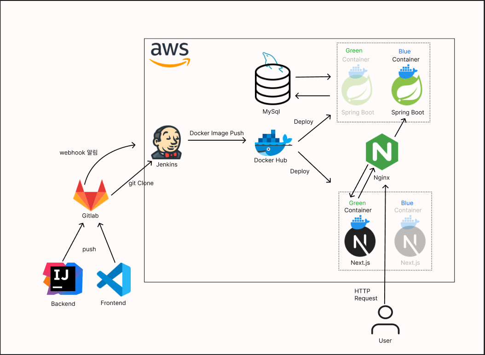

#  Web WMS(Warehouse Management System) Project : FitBox 

---

# 목차

- [📦 도메인 소개](#-도메인-소개)
- [📌 프로젝트 소개](#-Web-WMS-프로젝트-소개)
- [👥 팀 소개](#-팀-소개)
- [⏱ 개발 기간](#-개발-기간)
- [🛠️ 기술 스택](#-기술-스택)
- [🎋 브랜치 전략](#-브랜치-전략)
- [📜 커밋 컨벤션](#-커밋-컨벤션)
- [📄 프로젝트 구조](#-프로젝트-구조)
- [🌐 포팅 매뉴얼](#-포팅-매뉴얼)
- [💻 서비스 화면](#-서비스-화면)
- [📝 프로젝트 후기](#-프로젝트-후기)

 

- 배포 URL : https://i11a508.p.ssafy.io
- Test ID : ssafytest@naver.com
- Test PW : ssafy123!

 

# 📦 물류 도메인 소개

물류 도메인은 상품, 서비스, 정보, 자원의 물리적 이동을 계획하고 실행하며 관리하는 시스템을 포함합니다. 공급망의 중요한 부분으로, 다양한 산업에서 핵심적인 역할을 합니다.

## 주요 요소

### 🏢 창고 관리(Warehouse Management)
- 상품을 보관하는 공간을 관리하고, 상품의 입출고, 재고 관리 등을 포함합니다.
- 적절한 창고 관리는 제품의 신속한 배송과 고객 만족도 향상에 기여합니다.

### 📦 재고 관리(Inventory Management)
- 제품이나 자재의 양을 적절하게 유지하는 과정입니다. 과도한 재고나 부족한 재고를 방지하기 위한 전략이 포함됩니다.
- 재고 관리는 비용 절감과 운영 효율성을 높이기 위해 중요합니다.

### 📑 포장 및 취급(Packaging and Handling)
- 제품의 포장, 라벨링, 취급 절차를 관리하는 부분입니다.
- 올바른 포장은 제품의 손상 방지 및 고객의 만족도를 높이는 데 기여합니다.

### 📋 주문 처리(Order Fulfillment)
- 고객의 주문을 처리하고, 제품을 적시에 배송하기 위한 과정입니다.
- 이 과정은 물류의 신속성과 정확성에 크게 영향을 미칩니다.

### 🖥 물류 정보 시스템(Logistics Information Systems)
- 물류 활동을 모니터링, 관리, 분석하는 데 사용되는 IT 시스템입니다.
- 실시간 데이터와 분석을 통해 물류 프로세스를 최적화할 수 있습니다.

## 물류 도메인의 중요성

- **효율성**: 물류 도메인은 제품이 적시에 정확한 장소에 도착하도록 함으로써 전체 공급망의 효율성을 높입니다.
- **비용 절감**: 최적화된 물류 관리는 운송비, 보관비 등의 비용을 절감할 수 있습니다.
- **고객 만족**: 신속하고 정확한 물류 서비스는 고객 만족도를 높이고, 회사의 신뢰도를 향상시킵니다.
- **경쟁력**: 물류는 많은 산업에서 경쟁력을 결정짓는 요소로, 빠르고 효율적인 물류 시스템을 구축한 기업이 시장에서 우위를 점할 수 있습니다.

 

# 📌 Web WMS 프로젝트 소개

**Web WMS**는 무인 매장이나 창고에서 여러 위치의 재고를 효율적으로 관리할 수 있는 재고 관리 시스템입니다. 다양한 기능을 통해 다중 로케이션의 재고를 최적화하여 관리합니다.

## 주요 기능

### 📊 적정 재고 수준 유지
- 재고가 과도하게 쌓이거나 부족하지 않도록 최적의 재고 수준을 유지합니다.
- 효율적인 재고 관리를 통해 비용을 절감하고 운영의 안정성을 높입니다.

### 🛒 매장 품절율 최소화
- 실시간 재고 모니터링과 자동화된 알림 시스템을 통해 품절을 예방하고, 매출 손실을 최소화합니다.

### 🗄 재고 공간 최적화
- 공간을 효율적으로 사용하여 창고 및 매장의 재고 보관 능력을 극대화합니다.
- 재고 배치를 최적화하여 빠르고 효율적인 접근이 가능하도록 설계합니다.

### 🚶 작업자 동선 최소화
- 작업자의 이동 동선을 분석하여 최소화하고, 생산성을 높이는 배치 전략을 제공합니다.
- 이를 통해 작업 효율성을 극대화하고, 시간 낭비를 줄일 수 있습니다.

### 🔮 수요 예측
- 과거의 판매 데이터와 트렌드를 기반으로 수요를 예측하여 재고 계획을 지원합니다.
- 수요 변화에 신속히 대응할 수 있도록 예측 모델을 지속적으로 업데이트합니다.

## Web WMS의 가치

- **효율성**: 다양한 기능을 통해 재고 관리의 효율성을 극대화하여 운영 비용을 절감합니다.
- **최적화**: 재고 공간 및 작업자 동선을 최적화하여 생산성을 높입니다.
- **예측성**: 수요 예측 기능을 통해 미래의 재고 필요량을 정확히 예측하고, 공급망 관리의 안정성을 높입니다.

 

# 👥 팀 소개

<table align="center">
  <tr>
    <tr align="center">
        <td style="min-width: 250px;">
            <a href="https://it-whale.tistory.com">
              <b>김유석</b>
            </a>
        </td>
        <td style="min-width: 250px;">
            <a href="https://github.com/solmysoul1">
              <b>이한솔</b>
            </a> 
        </td>
        <td style="min-width: 250px;">
            <a href="https://github.com/hyeonjong-kim">
              <b>이수완</b>
            </a>
        </td>
    </tr>
    <tr align="center">
        <td style="min-width: 250px;">
              
        </td>
        <td style="min-width: 250px;">
              
        </td>
        <td style="min-width: 250px;">
              
        </td>
    </tr>
    <tr align="center">
        <td>
        <b>Team Leader, Project Manager</b><b> Backend Frontend </b>소셜로그인 유저/사업체 
        </td>
        <td>
        <b>Frontend Leader</b> 웹 사이트 디자인 총괄 메인페이지 구현 마이페이지 구현
        </td>
        <td>
        <b>Frontend</b> 창고 관리 주요 기능 구현 발표 및 영상 
        </td>
    </tr>
  <tr>
    <tr align="center">
        <td style="min-width: 250px;">
            <a href="https://github.com/DDongYul">
              <b>이동열</b>
            </a>
        </td>
        <td style="min-width: 250px;">
            <a href="https://github.com/pv104">
              <b>김준혁</b>
            </a>
        </td>
        <td style="min-width: 250px;">
            <a href="https://github.com/shin5774">
              <b>신권일</b>
            </a> 
        </td>
    </tr>
    <tr align="center">
        <td style="min-width: 250px;">
              
        </td>
        <td style="min-width: 250px;">
              
        </td>
        <td style="min-width: 250px;">
              
        </td>
    </tr>
    <tr align="center">
        <td>
        <b>Backend Leader, Infra</b> CI/CD 및 배포환경 구축 비즈니스 로직 구현 
        백엔드 성능개선 작업 
        </td>
        <td>
        <b>Backend</b> 상품 이동 재고 압축 리팩토링 
        </td>
        <td>
        <b>Backend</b> 상품 입고 및 출고 출고 최적화 백엔드 코드 리팩토링
        </td>
    </tr>
</table>

# ⏱ 개발 기간

- 2024-07-08 ~ 2024-08-16 (7주)
 

 

# 🛠️ 기술 스택

##### 📱 Frontend

##### 🔗 npm

##### 💻 Backend

##### 🚀 Infra

##### ⚙️ Management Tools

##### 🖥️ IDE

# 🎋 브랜치 전략

# 📜 커밋 컨벤션
> **태그**: 제목의 형태이며 ':' 뒤에만 space가 있음에 유의한다.
- **`feat`**: 새로운 기능 추가
- **`fix`**: 버그 수정
- **`docs`**: 문서 수정
- **`style`**: 코드 포맷팅, 세미콜론 누락
- **`refactor`**: 코드 리팩토링
- **`test`**: 테스트 코드 작성 및 수정
- **`chore`**: 빌드 업무 수정, 패키지 매니저 수정
 

# 📄 프로젝트 구조

 

# 🌐 포팅 매뉴얼

[포팅 매뉴얼 보러 가기](https://ddongyul.notion.site/13d3341fb6a54d76bd78ab94609820f3?pvs=74)
 
[git 루트](https://lab.ssafy.com/s11-webmobile2-sub2/S11P12A508/-/tree/dev-readme/exec?ref_type=heads)

# 💻 서비스 화면

|                                     |                                      |
|-------------------------------------|--------------------------------------|
|      |      |
| 
 `로그인` 
     | 
 `회원가입` 
     |
|     |    |
| 
 `창고 등록` 
   | 
 `창고 관리` 
    |
|     |      |
| 
 `창고 구매` 
   | 
 `창고 생성` 
    |
|   |       |
| 
 `로케이션 생성` 
 | 
 `벽 생성` 
     |
|       |        |
| 
 `상품 입고` 
   | 
 `상품 출고 ` 
   |
|     |  |
| 
 `상품 이동` 
   | 
 `알림 내역` 
    |

 

 

# 📝 프로젝트 후기

### 김유석
  재고의 이동과 다양한 경우의 수를 SW로 표현하고, 그 안에서 발생하는 다양한 반례를 통제하는 것이 특히 의미 있었던 것 같다.

   또한, 이를 통해 실제로 업무 현장에서 발생할 수 있는 문제들을 미리 예측하고 해결할 수 있다는 점에서 매우 큰 성취감을 느꼈다. 
   
   물류 산업은 데이터를 기반으로 생산성을 극대화할 수 있는 영역이 많아, 앞으로도 더 많은 발전 가능성이 있음을 실감했다. 이번 프로젝트를 통해    
   
   SW와 데이터를 활용한 자동화 및 최적화의 중요성을 다시 한 번 깨달았고, 앞으로도 지속적으로 이를 개선하고 발전시켜 무결점 프로젝트를 
   만들어야겠다는 생각이 들었다. 

   생소하고 재미없는 물류 프로젝트를 흥미롭게 생각해주고 재밌게 개발해준 팀원들에게 너무 감사하고 다음 프로젝트는 스스로 더 발전해서 팀원들을 더 
   
   편안하게 해주는 개발자로 성장하겠다. 이상
    

 
    
### 이동열
새로운 개념과 기술을 경험해볼 수 있는 프로젝트였다.

기획 과정에서는 재고 관리라는 새로운 개념을 배우고 이를 컴퓨터 시스템에 적용하는 데 어려움이 있었지만,
팀원들과 적극적으로 소통하면서 함께 해결해 나갈 수 있었다. 

기술적으로는 처음으로 인프라를 구축해보는 기회가 있었다. CI/CD를 설정하는 과정이 쉽지 않았지만 
마무리하고 나니 정말 뿌듯했다. 이를 기반으로 프로젝트가 원활하게 진행되어 매우 만족스러웠다. 

이처럼 많은 소통과 학습을 통해 얻은 것이 많은 의미 있는 프로젝트였다.

 

### 김준혁
처음 접하는 도메인이어서 도메인 지식을 공부하고 기획하는 데만 2주가 걸렸다. 저번 프로젝트의 총 진행 시간이 약 2주였음을 감안하면 꽤 긴 시간이었다.

기획에 꽤 오랜 시간이 걸렸기 때문에 실제 개발 시간은 부족할 줄 알았으나 일정 수준의 완성도까지는 오히려 더 금방 도달했다고 생각한다. 그만큼 좋은 기획의 중요성을 알게 되었다.

다만 초기 개발 과정에서 프론트와 소통하는 시간이 부족해서 한바탕 뒤엎는 과정이 있었다. 프론트와 더 빨리, 많이 소통했다면 더 나은 결과물이 나올 수 있었음을 생각하면 아쉬운 부분도 있다.

이번 프로젝트를 통해 새로운 도메인 지식을 받아들이는 방법, 좋은 코드를 작성하는 방법, 코드 리뷰의 중요성 등 현업에서 중요하다고 얘기하는 것들의 이유를 알 수 있게 되어 기쁘고 즐거운 경험이었다.

기술적으로는 EC2 서버에 RDS 데이터베이스를 올리는 경험을 했고, JPA를 다루는 능력이 향상되었다고 생각한다. 환경의 어려움 때문에 적용하진 못했지만 Redis, AWS Redshift와 같은 IN-MEMORY DATABASE에 대해서도
학습할 수 있어서 좋았다.

이번 프로젝트를 통해 한 단계 성장한 느낌이 든다. 이를 바탕으로 다음엔 더 잘 할 수 있겠다고 생각한다.

 

### 신권일
생소한 도메인을 가지고 프로젝트를 수행하게 되어 설계부터 어려움이 있었지만, 
이 과정에서 많은 경험을 얻었던 것 같습니다.

이를 통해 앞으로 또 다른 생소한 도메인을 기반으로 개발해야 할때 이번 프로젝트의 경험을 살려 더 좋은 결과를 만들어 낼 수 있을거라고 생각합니다.

 

### 이한솔
많은 사용자들에게 실질적으로 필요한 서비스를 개발하고자 했습니다.

단순히 기능들이 정상적으로 작동하는가를 넘어서서 어떻게하면
더 자연스러운 사용자 경험을 만들 수 있을까를 고민하며 프로젝트를 진행했습니다.

더 나은 서비스를 위해 여러 기능들을 추가하다보니 예상치 못한 오류들도 자주 겪었습니다.

오류들를 해결해 나가는 과정에서 백엔드와 프론트엔드 간의 소통의 중요성을 깨달았고
끊임 없이 소통하며 효율적인 업무의 흐름을 갖춰 나갈 수 있었습니다.

next.js 를 사용하여 프론트엔드 업무를 담당하면서 next.js의 프로젝트 구조를 이해할 수 있게 되었고
다양한 정보들을 화면에 즉각적으로 랜더링하는 업무들을 처리하며
next.js 에서의 상태 관리 방법을 확실하게 습득하게 되었습니다.

 

### 이수완
한 달 이상 지속되는 프로젝트가 처음인 만큼 많이 배운 것 같습니다. 1학기 때는 뭣도 모르고 머리에 넣기 바빴는데, 프로젝트를 통해 직접 써보고, 또 더 나아가서 찾아보고 이해하는 과정을 거쳐서 제가 원하는 것을 직접 구현하니 더 많이 배우고 체화되었다는 느낌이 듭니다.

아쉬운 점은 제가 제 능력을 모르고 기술에 대한 이해도가 부족하니 시간 설계에 있어서 어디까지 해낼 수 있을 지에 대해 아무것도 몰랐다는 점입니다.
하지만 동시에 그러한 부분을 채울 수 있었다는 점에서 좋았다고도 할 수 있습니다.

훌륭한 팀원 분들과 도메인 지식이 있는 팀장님의 콜라보로 7주 간의 여정을 잘 마무리할 수 있었던 것 같습니다. 
앞으로의 프로젝트들과 나아가 현업에서도 공통 프로젝트의 경험을 살려서 잘 헤쳐나가도록 하겠습니다. 다들 고생 많으셨고, 감사합니다.
