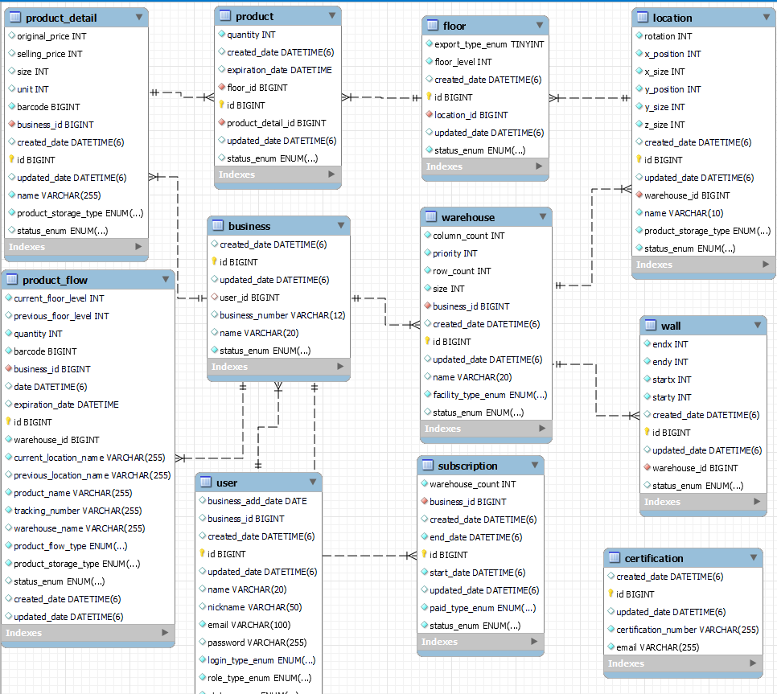

# 목차

- [📂 패키지 구조](#-패키지-구조)
- [🐞 트러블 슈팅](#-트러블-슈팅)
- [📓 ERD](#-ERD)
# 📂 패키지 구조
```
wms/
├── auth/
│ ├── common/
│ ├── config/~~~~
│ ├── controller/
│ ├── domain/
│ ├── dto/
│ │ ├── request/
│ │ │ └── auth/
│ │ ├── response/
│ │ │ └── auth/
│ ├── exception/
│ ├── filter/
│ ├── handler/
│ ├── provider/
│ ├── repository/
│ └── service/
│ └── implement/
├── business/
│ ├── controller/
│ ├── domain/
│ ├── dto/
│ ├── exception/
│ ├── mapper/
│ ├── repository/
│ └── service/
├── config/
├── floor/
│ ├── controller/
│ ├── domain/
│ ├── dto/
│ ├── exception/
│ ├── mapper/
│ ├── repository/
│ └── service/
├── location/
│ ├── controller/
│ ├── domain/
│ ├── dto/
│ ├── exception/
│ ├── mapper/
│ ├── repository/
│ └── service/
├── notification/
│ └── dto/
├── product/
│ ├── controller/
│ ├── domain/
│ ├── dto/
│ ├── exception/
│ ├── mapper/
│ ├── repository/
│ └── service/
├── productdetail/
│ ├── controller/
│ ├── domain/
│ ├── dto/
│ ├── exception/
│ ├── mapper/
│ ├── repository/
│ └── service/
├── subscription/
│ ├── controller/
│ ├── domain/
│ ├── dto/
│ ├── exception/
│ ├── mapper/
│ ├── repository/
│ └── service/
├── user/
│ ├── controller/
│ ├── domain/
│ ├── dto/
│ ├── exception/
│ ├── mapper/
│ ├── repository/
│ └── service/
├── util/
│ └── constant/
└── warehouse/
	├── controller/
	├── domain/
	├── dto/
	├── exception/
	├── mapper/
	├── repository/
	└── service/
```
# 🐞 트러블 슈팅

### Soft Delete 적용
- **문제 상황**: 프로젝트에서 JPA를 사용하여 소프트 딜리트(Soft Delete)를 일괄적으로 적용해야 하는 상황이 발생
- **해결 방안**: `@SQLRestriction` 어노테이션을 통해 소프트 딜리트 기능을 구현하여 문제를 해결

    ```java
    @Entity
    @Getter
    @NoArgsConstructor
    @SQLRestriction("status_enum = 'Active'")
    @Table(name = "product")
    public class Product extends BaseTimeEntity {
        // ...
    }
    ```
- **해결 과정**: 최초에는 `@Where` 어노테이션을 사용하여 문제를 해결하려고 시도 -> 
     그러나 현재 Hibernate 버전에서는 해당 어노테이션이 Deprecated
- **최종 해결 방안**: `@SQLRestriction` 어노테이션을 통해 소프트 딜리트를 구현.
    적용이 되지 않아야 하는 쿼리에 대해서는 JPA Repository에서 `@Query` 어노테이션을 사용

### Entity 순환참조 해결
- **문제 상황**: A엔티티 안에 B엔티티 정보가 있고, B엔티티 안에 A엔티티가 있어서 발생한 순환참조 문제
- **해결 방안**: 객체를 그대로 리턴하는 것이 아닌, Dto에 담아서 리턴.

### @Builder 어노테이션에 의한 default null error
- **문제 상황**: @Builder를 이용한 Builder로 객체를 생성할시 기존의 not null의 default로 처리했던 로직이 작동하지 않아 아래의 에러가 발생

  `'not-null property references a null or transient value'`

 
- **해결 방안**:@Builder.Default를 통해 해결

```java
@Builder.Default
@Column(nullable = false)
@Enumerated(EnumType.STRING)
private StatusEnum statusEnum = StatusEnum.ACTIVE;
```

### JPA native query 반환형 매핑 문제
- **문제 상황**: jpa Repository에서 native query를 사용하는 과정에서 반환형으로 설정해둔 DTO의 필드에 결과가 매칭되지 않는 문제. 다음과 같은 에러가 발생함.

  `No converter found capable of converting from type to Type`
- **해결 방안**: 반환형을 인터페이스로 하고 인터페이스는 다음과 같이 설정
```java
public interface ProductQuantityDto {

    Long getBarcode();

    Integer getPossibleQuantity();

    Integer getMovableQuantity();
}
```
### 리스트 참조시 java.lang.UnsupportedOperationException 발생
- **문제 상황**:  List 객체를 List.of 메서드로 초기화하고 참조할 때 UnsupportedOperationException이 발생


- **해결 방안**:  List 객체를 new ArrayList<>()로 생성하고 add 메서드를 사용하여 해결

  `List<Warehouse> warehouses = List.of(WarehouseMapper.fromDto(warehouseDto));`
  -> `List<Warehouse> warehouses = new ArrayList<>();
  warehouses.add(WarehouseMapper.fromDto(warehouseDto));`
# 📓 ERD
